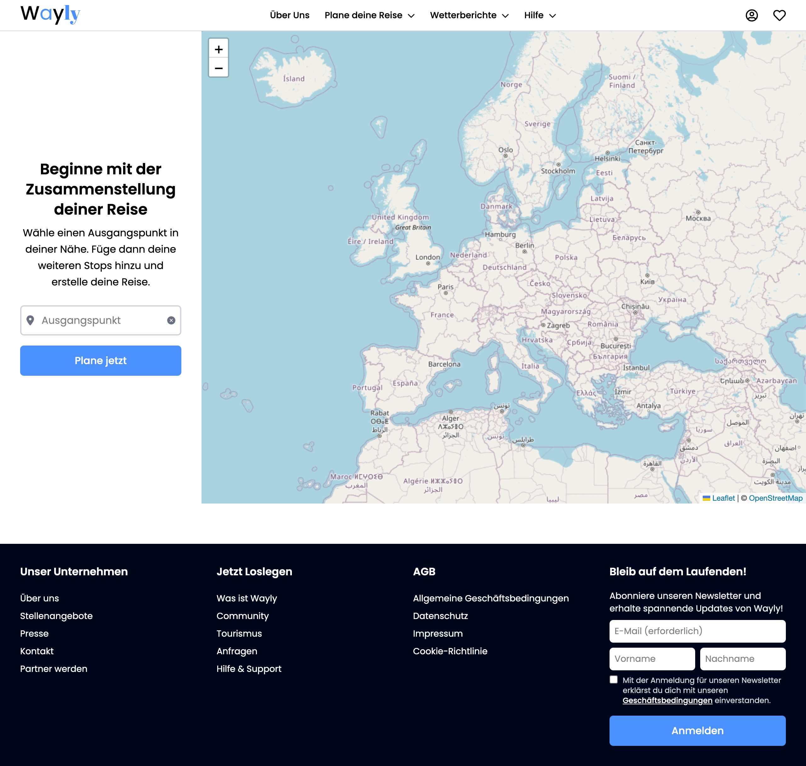
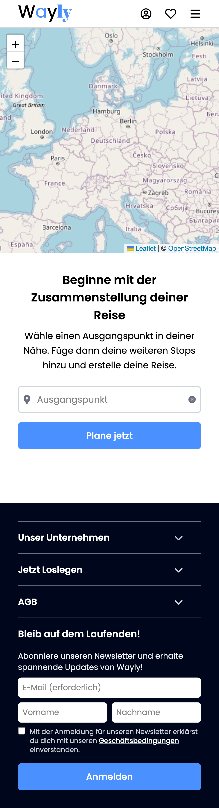

# 🌍 Wayly

Ein interaktiver Reiseplaner, mit dem Nutzer Orte suchen, auf einer Karte anzeigen, als Route speichern und deren Entfernungen berechnen können. Zusätzlich erhält man aktuelle Wetterinformationen zu jeder Destination.

## Features

- Interaktive Leaflet Map
- Geocoding API für Standortsuche
- Wetterdaten von Open-Meteo API
- Globale State-Verwaltung mit Zustand
- Zielpunkte als Marker hinzufügen/entfernen
- Routen speichern und löschen
- Berechnung der Luftlinie zwischen Zielen
- Responsives Design & Mobile Menü
- Feedback via Toast Notifications

## 🧠 Technologien

- React + Vite
- Zustand (State Management)
- Leaflet
- Tailwind CSS
- Open-Meteo API
- Geocoding / Location API
- React-hot-toast

## 🌐 Live Demo
[Live Demo](https://home-5018920212.app-ionos.space)

## Screenshots

### Desktop

### Mobile

## Beschreibung

TripPlanner ermöglicht es, schnell neue Reiseideen zu visualisieren und zu speichern.
Man kann Orte suchen, sie auf einer Karte markieren und nach Belieben mehrere Ziele zu einer Route hinzufügen.

## Hinweise

- Das ist mein zweites kleines React Projekt.
- Erstes mal State Management.
- Fokus: Clean Code, Structure, Learning by Building
- Ziel: Moderne Frontend-Patterns praktisch anwenden

## Was ich gelernt habe

- Arbeiten mit mehreren APIs gleichzeitig
- Globales State-Management mit Zustand
- Persistenter State (localStorage)
- Fehlerbehandlung & Loading-States
- Komponenten-Architektur planen
- Umgang mit Kartenbibliotheken (Leaflet)
- UX-Patterns (Dropdowns, Toasts, Modale)
- Responsives Design mit Tailwind
- Strukturierung eines React Projekts

## Fazit

Ein Projekt, in dem ich meine Grundlagen in React stark ausbauen konnte.
Ich habe gelernt, APIs sinnvoll zu kombinieren, globalen State sauber zu handhaben und ein strukturiertes, responsives UI zu erstellen.
